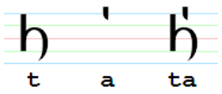
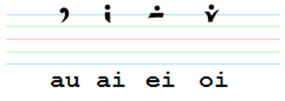
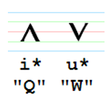
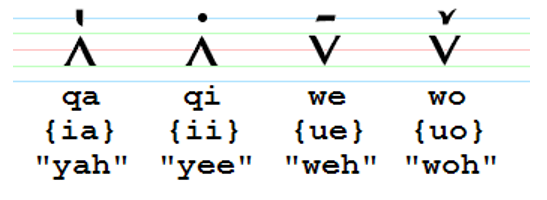
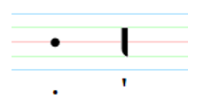
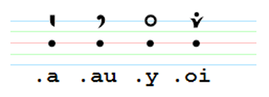
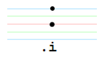
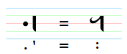
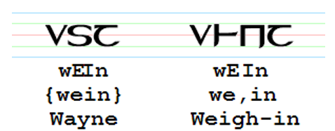

# Zbalermorna

A diacritic orthography for Lojban.

noi se finti la .kmir.

## Introduction

Zbalermorna is a diacritic system of writing, designed for use with the constructed language, Lojban.

Sounds are constructed from a base symbol that represents a consonant, which is then modified, if necessary, by another smaller symbol called a diacritic, that represents a vowel. Together, a single consonant symbol with a single vowel symbol represent a syllable, with the consonant sound first.

Consonants are not always required to be modified, and a consonant by itself only represents the sound that is assigned to it. Unmodified consonants can be used before modified ones to create blended consonants, or after them to create a final consonant for the syllable.

Zbalermorna has several features that Latin Lojban does not have. Some of these are fundamentally important to Zbalermorna, and some are not, and are hence optional.

The new features you'll find to be different from Latin are:

* Semivowels
* Combined vowels
* Absence of the Comma
* Special vowels for non-lojban words
* Special treatment of '.'

and the optional features are:

* A few shorthand versions of common symbols
* Silence
* Some basic tools for transcribing vocal dynamics

Here are the main set of sounds treated as consonants in Zbalermorna:

Much consideration has been given to the shape of the consonant characters, in order to ensure that they are distinct, are easy to write and read, follow some kind of meaningful pattern or system and are hard to render illegible by rushed or lazy handwriting. Here are some features of the consonant design you may notice:

### Voiced Pairs

With the exception of “x”, note that each consonant has a sister shape, created by rotation of 180 degrees about the text centerline. The pairing roughly represents a pairing of the sounds with their voiced or unvoiced selves.

Notice that for all the unvoiced sounds, if they have stems, they go upward. And similarly, voiced sounds point downward. The nasal sounds, N and M, and the liquid sounds, L and R, do not have proper voiced/unvoiced equivalents. Instead, they are paired together for their similarities. It is not completely accurate, but it is convenient and elegant to group them in this way.

### Stem Grouping

The shape of the characters, and in particular the way in which the stems protrude from them is meaningful. The character shapes are deliberately designed to be grouped based on the sonic qualities of the sounds they represent.

Note the following:

The sounds classified as 'stops', P, T, K have their stems on the left side (and on the right side for their voiced sisters B, D, G).

The sounds classified as 'sibilants', S and C have their stems on the right side (and on the left side for their voiced sisters, Z and J).

The sounds classified as 'fricatives', F and V theoretically have central stems. However, if they were normal length, they would interfere with the space which is occupied by the diacritic.

The nasals N & M and the liquids L & R are deliberately round and stemless. This distinguishes them from the set that are "proper" voiced/unvoiced pairs.

### X stands alone

X has no voiced or unvoiced partner in Lojban, therefore it makes sense to assign X a shape that does not rotate at all: the circle.

## Vowel Diacritics

Here are Lojban's 6 vowels, as diacritics:

Vowels are written above the consonants to create syllables, and in combination with diacritic-less consonants to create whole words.

### Diphthongs

Lojban combines vowels into single sounds which are transcribed in Latin as two letters. Out of all the combinations of the 6 Lojban vowels, only 16 are actually used in spoken Lojban:

One can see that six of these are made from just "i" + everything and six are just "u" + everything. These are handled by a set of characters called semivowels, which are explained in [Semivowels](#semivowels).

The remaining 4 diphthongs are assigned their own diacritics:

The diphthong "au" is unique, as it is the only one with a final "u", and it has a unique character.

The others, all with final "i"s, are created by combining the character for the base vowel diacritic with the diacritic for "i". This somewhat reflects the original Latin "two letters" transcription method, however with the benefit of still only taking up one letter's worth of horizontal space.

Of the 16 allowed diphthongs, it should be noted that both “iy” and “uy” are technically allowed but never appear in native Lojban words. They are reserved for use in Lojbanising proper names or foreign (non-lojban) words.

## Semivowels

Semivowels are a method of addressing common words which begin with vowels. The main reason for using semivowels is to avoid having individual diacritics for each of the 16 legal diphthongs.

There are only two semivowels, one which represents the column of
diphthongs beginning with “i” from Fig 1c3, and the other represents
the column of diphthongs beginning with “u”.

The semivowels are commonly referred to by their short names, which are “q” and “w” respectively. One way to remember which is which is to remember that “w” is the sound one makes when pronouncing diphthongs which begin with “u”, like {ui}.

The names “q” and “w” were used because they are the two letters from the Latin alphabet that go unused by normal Lojban. Giving them each a letter in this way also provides an effective way to type them.

Interestingly, the “q” and “w” diphthongs are never used with consonants. There are simply no words in Lojban which use a medial “i*” or “u*” diphthongs. This means the only case in native Lojban where “q” and “w” diphthongs appear is in attitudinal cmavo.

Semivowels can also be used for transcribing cmene and non-lojban loanwords; this is described in [Full Vowels](#full-vowels).

## Break Characters

Break characters are the period {denpabu} and apostrophe {.y'ybu}.

In Zbalermorna, both are used in the same way as consonants, designed to carry vowel diacritics when required.

In Latin Lojban, the comma “,” is also a break, but Zbalermorna uses a different system to cope with the need for a comma, as detailed later on, and so does not include one.

### Period

Functionally, the period is an 'optional reminder' to pause before a word that begins with a vowel, or before and after a cmene or loanword.

In Zbalermorna it also serves as the “null consonant”, to carry single vowel diacritics, either for small cmavo or at the start of cmene that begin with vowels.

An advantage of this system, and one of the reasons that the dot diacritic was chosen to represent the “i” sound, is that the most common cmavo in the whole language, {.i}, gets an extremely rapid notation: just two dots.

### Apostrophe

The apostrophe {.y'ybu} is used in a very similar way to the Latin mode. Like the period it functions like a consonant.

### Attitudinal Shorthand

The Zbalermorna apostrophe also has an alternate form called the “Combining .y'ybu” or “Attitudinal Shorthand”, to make it more natural to write the denpabu and .y'ybu one after another, a sequence which represents the majority of the set of attitudinals. It looks like this:

The combining .y'ybu is functionally identical to writing a period and an apostrophe normally. It is the only character for which it is legal to assign more than one diacritic.

Although designed to assist handwriting, it should be supported by the computerised font and be typed with a colon, “:”.

Here is the set of cmavo from:

## Full vowels

The full vowels are a separate set of consonant-sized characters that map directly to the vowel diacritics. They are used only in names and loanwords, never in “native” Lojban words.

No diacritics are used in non-lojban words. All other symbols are allowed, including semivowels to force {i*} or {u*} diphthongs. Some examples are shown with Latin Lojban equivalents:

There are two reasons for using full vowels:

Firstly, to give a distinct visual style and flavour to non-lojban words, so they stand out in a text and can be identified as requiring a pause before and/or after it. For this reason, a 'lone' period with no diacritic is not required, and is discouraged from being used.

Secondly, to implement some Lojbanisation workarounds made possible by the comma. In Latin Lojban, the comma is used to prevent vowels written next to each other being interpreted as a diphthong in names.

In Zbalermorna, because diphthongs are written as distinct characters, there is no confusion as to which interpretation is intended. If the word is written with diphthongs, it is pronounced as such, and if not, it is not. Compare:

## Optional Features

Following are optional features of Zbalermorna. They are intended to enhance expressiveness in poetic texts, comic strips, drawings and paintings or informal communication by providing transcription methods for vocal timing and dynamics.

It is important that the optional features always take the back seat to correct, unambiguous Lojban. They may not be relied on to carry context or meaning. If you intend to use them, check your Lojban first and ensure your bridi still makes sense without them.

**SPECIAL NOTE:** The single-dot dynamics diacritic or “stress dot” is the proper method of forcing odd stress patterns in non-lojban words. In this way, it is in fact NOT optional at all. See [Dynamics](#dynamics).

### Silence

Zbalermorna has a silence character, a straight horizontal line at the text centerline. It can be any length to give a sense of relative timing if it is useful to the writer.

### Stretch

This diacritic is used to extend the time spent vocalising a particular vowel. It's good for sarcasm. Again it can be any length.

### Intonation

Very basic diacritics for describing intonation. Can be useful for emotional expression or comedic delivery.

### Dynamics

These are a set of characters which denote relative levels of volume or emphasis. There are three levels. Three dots is more emphatic than two dots, and two dots is in turn more than one dot, which is more than no dots.

One dot is called a ”single-dot dynamics diacritic”, but more commonly called a stress dot, or in Lojban, {ba'ebu}.

The stress dot is the standard method of forcing non-penultimate stress in names and loanwords. This function replaces the use of capital letters in Latin Lojban. Example:

The poetic use of dynamics is to show relative levels of emphasis. When used on a syllable which is stressed normally, a single stress dot shows a slight relative increase in emphasis compared to words or bridi which use no stress dots. Consider a spoken/barked order:

Using a double or triple in a bridi with no other stress marks creates a larger disparity between the stress on that syllable and the rest of the bridi. Additionally, using lesser marks on every other syllable raises the overall emphasis for the whole bridi.

## Handwriting

Zbalermorna is primarily designed to be written by hand. It is best suited to writing with the right hand, but can be adapted. The flow of the hand goes in a saw-like pattern left to right:

downstroke upstroke
Character strokes strive to keep to this pattern

Sentences may be written in two ways, either writing each character in order as they appear, or by writing all consonant characters first and then going back and filling in the vowels.

### Spacing

The five-line layout guide employed so far in this document maps to
normal lined paper like so:

ku lu   ku lu
The 5-line diagram maps onto lined paper

Using every line in this format is plausible if you try to keep the diacritics low, but realistically, frequent collisions between diacritics and text from the preceding line make it an unsuitable layout. On normal lined paper, it is recommended to write on every alternate line.

Ideally, Zbalermorna should be handwritten on lined paper with every second line at 50% height, to minimise wastage from skipping lines: [LINK TO PAPER](link)

999
Theoretical "Zbalermorna paper" with alternating line sizes

### Proper Form

The characters are designed to withstand a reasonable amount of distortion due to variance in handwriting accuracy. Following is a chart which demonstrates the essential form of each character, based on guide points. Failure to reproduce these features results in a collapse in recognisability for that character.

Consonants

Vowels

Full Vowels

. ' : q w

Line guides for main characters

* Green points are curves
  The shape fails when there is a corner, or no line at this point.
* Red points are corners.
  the shape fails when there is a curve, or no line at this point.
* Black points are line starts.
  In formal writing, lines should start at these points.
* Arrowheads are line descenders.
  These represent the formal end points for lines, but which can be extended without the shape failing.

If there is no arrow, it is recommended that the line not be extended past the point on the guide. For example, note that the full vowels have no arrowheads. This is because it betrays the intended aesthetic for those characters; however, if line lengths in the full vowel set were changed, it would probably not render the characters unreadable.

Informally, generally much liberty can be taken with the line start points, lengths and other properties of the shapes. See 'Flourish' section for examples.

### Corner Tolerence

A corner is defined for the purposes of this style guide as a point on a continuum between a loop and a curve. See following diagram:

loop corner curve
Loop-curve spectrum has 'corner' as a midpoint

You can also think of a corner defined this way as a loop with a radius of zero.

It is acceptable style to produce corners that are past the 'corner' point in the 'loop' direction, but not in the 'curve' direction. Anything curvier than the basic corner is a curve, but loops are still valid as corners.

Acceptable distortion for T and K shapes

* Sample 5 is technically allowable as a T but is becoming dangerously close to being a badly formed K. It is still a T however because it is still curved.
* Compare to sample 2 which fails as a T but is a legal K.
* Sample 6 is a legal K because loops count as corners
* Sample 7 is a failed K but a legal T.

### Flourish

When handwriting for expressive or presentation purposes, the writer may find artistic distortions of character shapes to be aesthetic or useful. This sections details some methods of distorting the shapes while maintaining legibility.

Of course, when writing artistically, it is up to the artist as to what counts as legible, or indeed if legibility is even the point of the work. Following are some suggestions for artistic flourishes that can be used without failing the readability criteria.

Extending final lines

Looping corners

Extending stems

Using serifs

## Typing

Zbalermorna is to be implemented as a scripted OpenType font. This means that a correctly scripted Zbalermorna font should allow the user to input any character they need using any keyboard layout.

<strong>The font work is currently incomplete.</strong>

Crucially, the nature of Zbalermorna means the font can NOT interpret an existing string of Latin Lojban and re-render it correctly. Follows is a Zbalermorna-to-Latin equivalency chart for typing:

Zbalermorna-to-Latin equivalency chart

- All basic characters map to their Latin versions
- .y'ybu will map to both the apostrophe and 'h'
- 1DDD stands for “single-dot dynamic diacritic and so for 2 & 3
- CAS is “combined attitudinal shorthand” and maps to : and “
- Intonation diacritics map to the numbers 1-4
- Stress dots can also be typed using capital consonant characters.